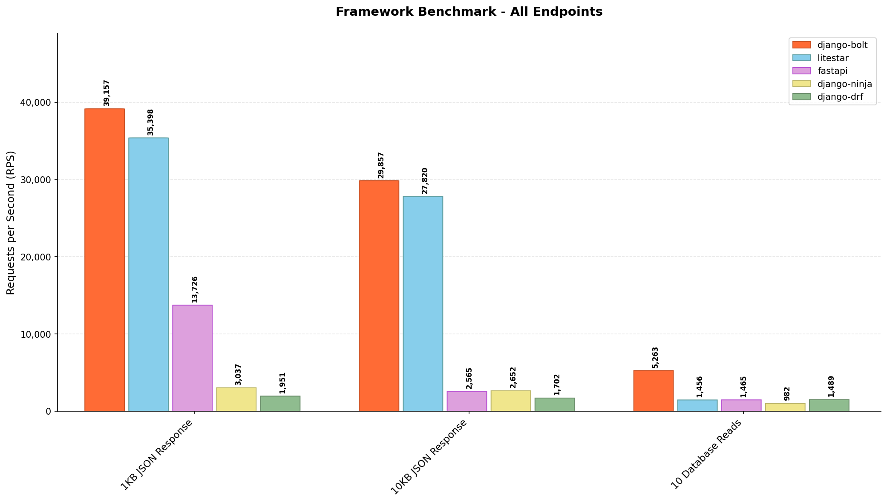

# Python API Framework Benchmark (with Django REST Framework)

> **Extended from:** [fastapi-vs-litestar-vs-django-bolt-vs-django-ninja-benchmarks](https://github.com/FarhanAliRaza/fastapi-vs-litestar-vs-django-bolt-vs-django-ninja-benchmarks)
> **Addition:** Django REST Framework benchmarks added for comprehensive comparison



**[Django Bolt](https://github.com/FarhanAliRaza/django-bolt) wins across all endpoints**, showing significant performance gains especially for JSON serialization workloads. Django REST Framework shows the lowest performance in JSON endpoints but maintains competitive database query performance.

> **Disclaimer:** This is an informal benchmark run on a local development machine without proper isolation. It does not follow benchmarking best practices such as Docker containerization, CPU pinning, or elimination of background process interference. Results may vary significantly in production environments. Take these numbers as a rough indicator, not absolute truth.

---

Compares 5 Python web frameworks with identical endpoints:

- **[FastAPI](https://github.com/fastapi/fastapi)** - ASGI framework with Pydantic
- **[Litestar](https://github.com/litestar-org/litestar)** - High-performance ASGI framework
- **[Django Ninja](https://github.com/vitalik/django-ninja)** - Django + Pydantic API framework
- **[Django Bolt](https://github.com/FarhanAliRaza/django-bolt)** - Rust-powered Django API framework
- **[Django REST Framework](https://github.com/encode/django-rest-framework)** - Traditional Django REST API framework

## Endpoints

| Endpoint    | Description                   |
| ----------- | ----------------------------- |
| `/json-1k`  | Returns ~1KB JSON response    |
| `/json-10k` | Returns ~10KB JSON response   |
| `/db`       | 10 reads from SQLite database |
| `/slow`     | Mock API with 2 second delay  |

## Requirements

- Python 3.12+
- [uv](https://github.com/astral-sh/uv) package manager
- [bombardier](https://github.com/codesenberg/bombardier) HTTP benchmarking tool

Install bombardier:

```bash
go install github.com/codesenberg/bombardier@latest
```

## Quick Start

```bash
# Setup (run once)
./setup.sh

# Run all benchmarks
./run_all.sh

# Or with custom options
./run_all.sh -c 200 -d 15 -r 5
```

## Manual Usage

### 1. Setup

```bash
./setup.sh
```

### 2. Start Servers (in separate terminals)

```bash
./run_fastapi.sh   # Port 8001
./run_litestar.sh  # Port 8002
./run_ninja.sh     # Port 8003
./run_bolt.sh      # Port 8004
./run_drf.sh       # Port 8005
```

### 3. Run Benchmark

```bash
uv run python bench.py
```

### Benchmark Options

```
-c, --connections  Concurrent connections (default: 100)
-d, --duration     Duration per endpoint in seconds (default: 10)
-w, --warmup       Warmup requests (default: 1000)
-r, --runs         Runs per endpoint (default: 3)
-o, --output       Output file (default: BENCHMARK_RESULTS.md)
--frameworks       Frameworks to benchmark (default: all)
```

## Server Ports

| Framework    | Port |
| ------------ | ---- |
| FastAPI      | 8001 |
| Litestar     | 8002 |
| Django Ninja | 8003 |
| Django Bolt  | 8004 |
| Django DRF   | 8005 |

